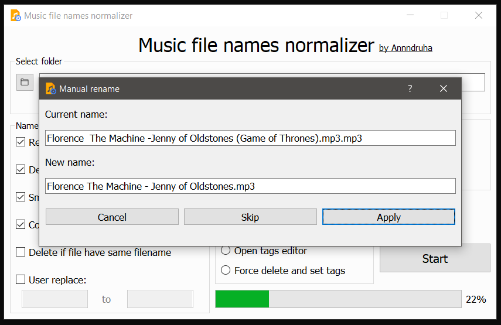

# Music files normalizer

### Correcting filenames and edit tags

Use for mass music files renaming and correcting. For run on Windows just download exe portable verion.

**Features:**

Mass name editor:

+ Rename audiofile to the more beautiful and correct variant
+ Replace double file extension to one
+ Smart fix underscore and dash issue
+ Delete brackets option
+ User rename expansion
+ Manual rename dialog (for fully correct)
+ Force nameedit

Tag editor:
+ Open window with most useful tags
+ Set artist and song tag by filename
+ Delete all tags

**Screenshots:**

**How to run:**

If you have windows, you can use ready-to-start `Music files normalizer.exe` file.
In the other case, you need to install python 3.8 and packages from requirements. After that run `main.py`
If you want to change code, just do it, generate ui.py files by bats, replace it in root folder, pip install pyinstaller and run build.bat

Enjoy!
